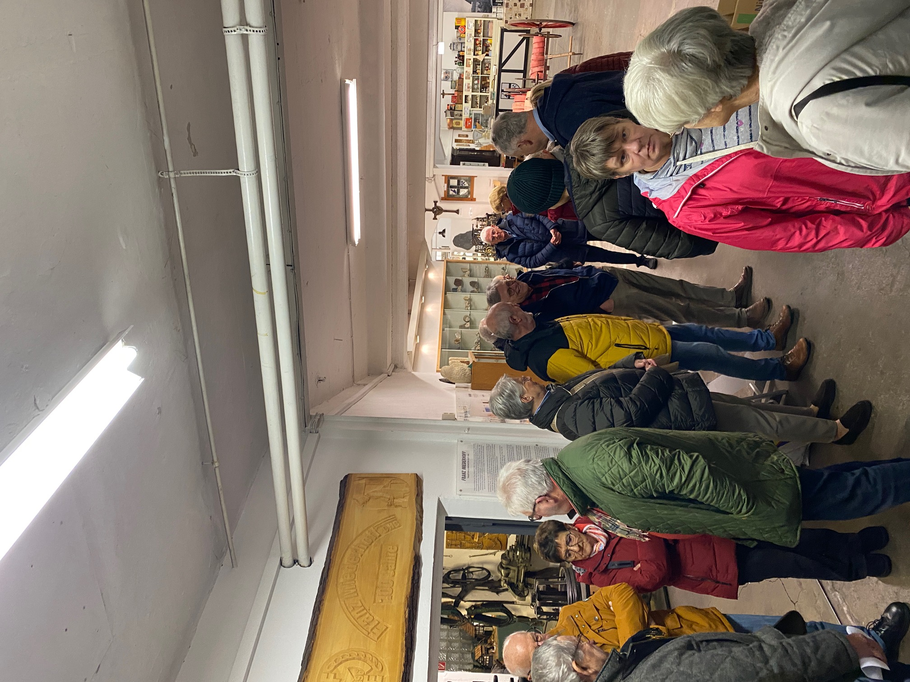

24 Teilnehmer des Sunderner Heimatbundes haben im Rahmen der letzten Exkursion
des Jahres 2024 das Jagd- und Heimatmuseum in Endorf besucht.

Die Führung umfasste die in 3 Geschossen liegenden Räumlichkeiten, die Exponate
des täglichen Lebens, alter Gewerbezweige und eine große Jagdausstellung zeigen.
Hier gaben Herr Geuecke und Herr Hillebrandt eine Einführung in die
Entstehungsgeschichte des Museums.

Die vielen Rückfragen der Teilnehmer zu den zahlreichen heute nicht mehr
verwendeten Utensilien, Hilfsmitteln und Werkzeugen, die mit viel Akribie
zusammengetragen wurden, konnten ausnahmslos beantwortet werden.

Bei der anschließenden Einkehr im Landgasthof Klöckener bot sich die Gelegenheit
das Jahr noch einmal Revue passieren zu lassen.

